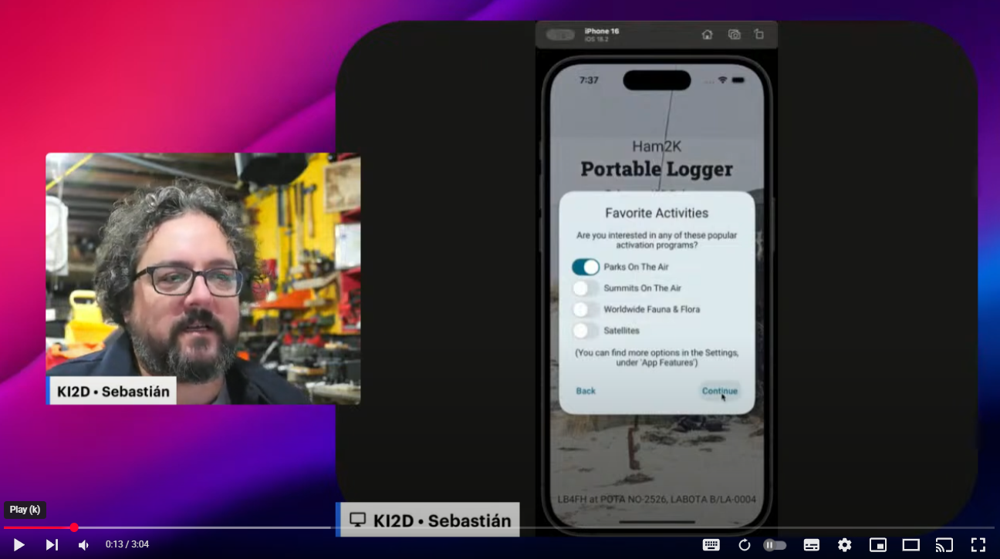

In PoLo, an **Operation** is a collection of contacts made during a specific event or activity. For example, you might create an Operation for a park activation, a contest, or a special event station.

To get started, add a new operation and select it, then select any specific activations or special activities associated with it.

Once you're happy with the operation settings, you can start logging contacts in the "QSOs" tab. But first, remember to check the
band and mode and adjust them as needed.

You can log a QSO by entering the callsign of the station you contacted, then pressing the `[Send]` key or button on the screen.

Keep logging contacts, and once you're done go to the "Operation" tab and select "Export Log Files" to generate ADIF files
that you can use to submit your activation.

The following manual will explain many of the features you expect to use in more detail.

Watch this video for a live demonstration.

For more videos, [check out the youtube channel](https://www.youtube.com/@Ham2KApps/videos)