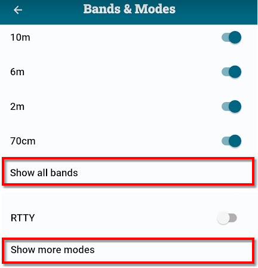

## Select the Bands and Modes you operate on

All frequency bands and modes that PoLo supports are made available for use from Settings > Logging Settings > Bands & Modes. Initially the common bands and modes are available, this can be changed to all bands, and all modes by tapping 'Show all bands' or 'Show more modes' at the bottom of each section.

Once you have access to the band or mode you're searching for enable it by using its switch. Backing out of that page to the Logging Settings page will show you the bands and modes available to be used in a new operation.

### Enabling other modes and bands
The list of the most popular modes and bands are enabled by default. There are numerous other bands and modes available and can be enabled by the user.

To enable more Bands or Modes, first select Logging Settings then click Bands and Modes. The currently available bands and modes are listed on the next screen which allows for more to be enabled by clicking the slider controls. Still more bands and modes are available behind the `Show all bands` or `Show more modes` item.

Once open, the Bands & Modes page will show even more bands or modes. Enable the bands or modes desired using the slider controls and return to Operation Settings

