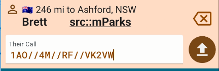

Everyone will have their favourite way to handle a pileup. For those who like the callsign fragment method i.e. one where you might scribble down callsign fragments and then back track to each fragment in the list one at a time, then Callsign Stacking may be of interest.

In the "Their Call" entry field, enter each fragment that is heard separated by double slashes or two dots which will be converted to slashes.

Then work backwards through the stack, correcting each call until confirmed. Once confirmed, send the corrected call to your log.

Sending a complete call will remove it from the stack and leave the stack ready for correcting the next partial/fragment.

Continue until all fragments are corrected and submittted.

Watch this video for a live demonstration.

For more videos, [check out the Ham2K YouTube channe](https://www.youtube.com/@Ham2KApps/videos)