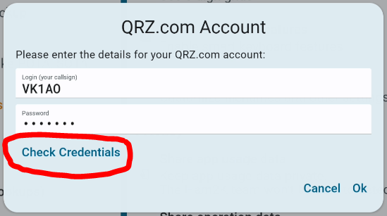
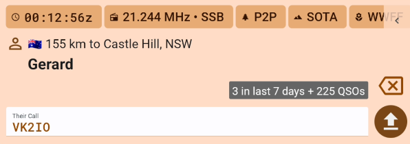

PoLo offers several sources for data both offline and online. 
* **QRZ Lookup** is the primary source of online data and falls into two categories depending on whether you have
* a **paid subscripion** to QRZ or
* use **only the free account provisions**. In addition to this source, there is the
* [**Callsign Notes**](https://polo.ham2k.com/docs/polo-features/callsign-notes/) feature which is data downloaded and avilable offline,
* and also history from both the **Operations** present on the device and any historical **ADIF data** you have chosen to import.
* HamDB lookups (free, but US, Canada and Germany only)

### QRZ Lookups
QRZ XML data Lookups are available for both free accounts and paid subscription. The data offered by QRZ retrieved during the query to QRZ is, however, different in each case. According to QRZ policy, free accounts provide for 100 lookups per day after which no data will be returned. Additionally, the data provided for free accounts is a subset of the data returned for paid account queries. Your QRZ account details on the qrz.com website will show your Callsign Lookup Activity as total web lookups today, total XML lookups today and your daily maximum limit is also shown. The lowest QRZ subscription level of "XML Data" will provide unlimited XML data lookups.

### QRZ Authentication
Please remember that logging into QRZ via the API requires that you use your callsign, **NOT** your email address. You can use either email address or callsign when logging on to your QRZ account, but only your callsign for the api which is required for lookups.

Addtionally, the QRZ API is known to have problems with passwords with some special characters that might work fine when logging thru the web. If you're having problems using your credentials in PoLo, please consider changing your password to use only letters, numbers and common symbols.

Use the account **Check Credentials** link to ensure you have the password correct



If a login is successful, this link test will change to a tick


### Operation Data
Previous Operations may be left on your device and serve as data lookups in the event that no cell coverage is available and no ADIF data has been uploaded to the device. [**Callsign Notes**](https://polo.ham2k.com/docs/polo-features/callsign-notes/), if enabled, will always be presented on the callsign entry form when a callsign match is found.

Operation Data also serves to provide statistics with regard to the number of contacts/QSOs made with another operator.

### ADIF History
It is also possible to upload an ADIF file to your device to serve as lookup data. In this case, historical lookups are done across all operations plus the ADIF records you have loaded.


Enabling Call History data lookups will use the historic ADIF data imported under Data Settings for data lookups. It will also enable QSO statistics to be calculated from all data (Operations and Historic ADIF imports) and display summaries when both entering/editing QSOs and displayed on the full callsign lookup panel.



#### Differences in Data returned by QRZ free accounts versus paid subscriptions
The XML data fields returned from a callsign query for free QRZ subscriptions are limited to **FirstName, Surname, Address, Country** field values only. The raw data return from such a query is show below and includes a Session Message that **A subscription is required to access the complete record.**

In particular, queries for free subscribers DO NOT include grid locators, which is what PoLo uses to show the QSOs on maps.

```<QRZDatabase version="1.36" xmlns="http://xmldata.qrz.com">
<Callsign>
<call>VK1AO</call>
<fname>Alan</fname>
<name>McDonald</name>
<addr2>Yellowtail Way NSW</addr2>
<country>Australia</country>
</Callsign>
<Session>
<Key>8080e595830xxx23939b3fefa049983e</Key>
<Count>3</Count>
<SubExp>non-subscriber</SubExp>
<Message>A subscription is required to access the complete record.</Message>
<GMTime>Sat Aug 10 03:11:55 2024</GMTime>
<Remark>cpu: 0.017s</Remark>
</Session>
</QRZDatabase>
```

For subscribers to QRZ, the XML data returned is comprehensive and includes the sort after callsign gridsquare and QRZ primary image link. The callsign gridsquare, if returned, will be used in the QSO Map. The veracity of the gridsquare is, of course, subject to whether the OP being queried has recorded accurate data.

```<?xml version="1.0" encoding="utf-8" ?>
<QRZDatabase version="1.36" xmlns="http://xmldata.qrz.com">
<Callsign>
<call>VK1AO</call>
<aliases>4W/VK1AO,VK2MET,AX1AO,VK1O</aliases>
<dxcc>150</dxcc>
<fname>Alan</fname>
<name>McDonald</name>
<addr1>Worimi Country - Yellowtail Way</addr1>
<addr2>CORLETTE NSW</addr2>
<zip>2315</zip>
<country>Australia</country>
<lat>-32.729451</lat>
<lon>152.117641</lon>
<grid>QF67bg</grid>
<ccode>18</ccode>
<land>Australia</land>
<efdate>0000-00-00</efdate>
<expdate>0000-00-00</expdate>
<qslmgr>eQSL, LoTW, HRDLOG.net, ClubLog and OQRS (see below)</qslmgr>
<email>vk2met@meta.com.au</email>
<u_views>12043</u_views>
<bio>55766</bio>
<biodate>2024-07-22 08:47:47</biodate>
<image>https://cdn-xml.qrz.com/o/vk1ao/rd_VK1AO_with_Badges_Alignment_M.png</image>
<imageinfo>337:770:498048</imageinfo>
<moddate>2024-07-31 11:57:02</moddate>
<eqsl>1</eqsl>
<mqsl>0</mqsl>
<cqzone>30</cqzone>
<ituzone>59</ituzone>
<iota>OC-001</iota>
<lotw>1</lotw>
<geoloc>user</geoloc>
<name_fmt>Alan McDonald</name_fmt>
</Callsign>
<Session>
<Key>64772b0a412573xxxd61071d6fac6d19</Key>
<Count>99619</Count>
<SubExp>Mon Apr 21 16:06:43 2025</SubExp>
<GMTime>Sat Aug 10 03:12:19 2024</GMTime>
<Remark>cpu: 0.020s</Remark>
</Session>
</QRZDatabase> 
```
