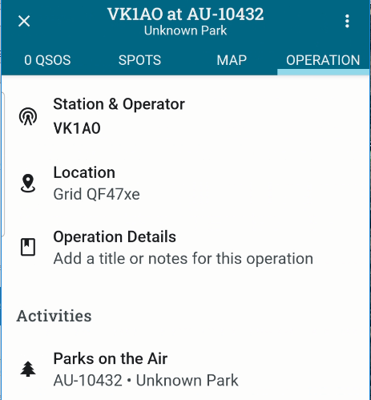

During an operation PoLo only needs an Internet connection to enable spotting, and to pull contact data from qrz.com, all other data is stored on your device.

These offline data files, those within the Settings > Offline Data area along with those in Settings Callsign Notes synchronise periodically dependant on how often they might change. Callsign Notes update daily; the well established programmes such as SOTA update every 3 months or so, but POTA and WWFF are set to update monthly due to their possibilty of expanding as more sites are included within those programmes.

Each of these data sets can be refreshed manually by selecting them in the Data Settings area, and tapping Refresh on the pop-up.

---

### POTA Park Names
**Why does my POTA park name show in the operation title as "Unknown Park"?**

While online and assigning a park by number to your operation, an api is used to retrieve the park name. While this name is retrieved and displayed on the activity list, it is not stored separately from the name in the offline list stored for use while offline.

When you return to the operation Home screen, you may see "Unknown Park" in the Operation title. This is due to the offline list being out of date. Additionally, the park list available to download is only generated every 24hours and the auto prompt to update the list is weeks apart.

To remedy this situation, Update your parks list, then remove and reinstate the park in question. It is likely that the park will now have a name to go with the ID number.

Removing and reinstating the park from an Operation will not break anything or harm your QSO data. If the name remains as "Unknown Park" then the offline download file has not yet been updated.

The presence of "Unknown Park" in the Operation title in no way harms the operation or the export of the log used for upload to POTA. The ID number is the key element used here. The full log may contain the park name if you use a template that refers to it. In this case you may wish to again do an offline data update before doing the full log export.