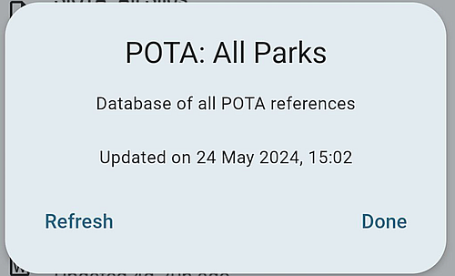

During an operation PoLo only needs an Internet connection to enable spotting, and to pull contact data from qrz.com, all other data is stored on your device.

These offline data files, those within the Settings > Offline Data area along with those in Settings Callsign Notes synchronise periodically dependant on how often they might change. Callsign Notes update daily; the well established programmes such as SOTA update every 3 months or so, but POTA and WWFF are set to update monthly due to their possibilty of expanding as more sites are included within those programmes.

Each of these data sets can be refreshed manually by selecting them in the Data Settings area, and tapping Refresh on the pop-up.

