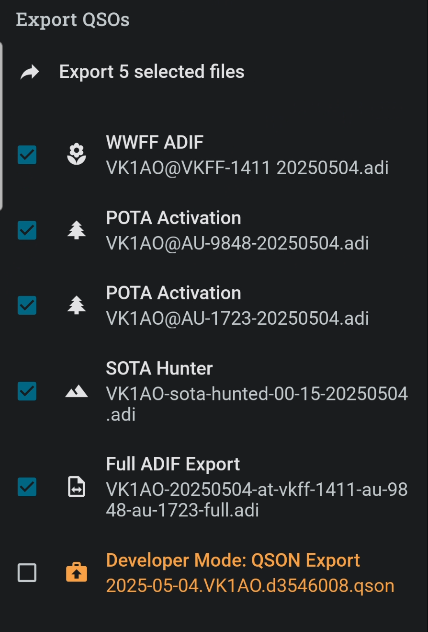
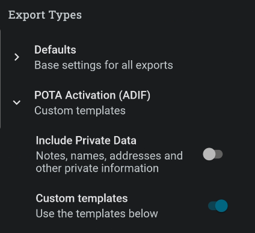

## Privacy Regulations

Data privacy regulations are laws that govern how organizations collect, use, store, and share personal data. These regulations aim to protect individuals' rights and ensure that their personal information is handled responsibly and securely. Key regulations include the General Data Protection Regulation (GDPR) in the European Union, the California Consumer Privacy Act (CCPA) in the United States, and the Privacy Act 1988 in Australia. 

## Data lookups and your rights

Many of us provide personal data to places like QRZ to enhance our experience in Amateur Radio and inform our contact partners of our QTH location etc.

With any form of subscription to lookup services, it is intended that other people's data you lookup and store locally stays with you locally and does not get propagated again and again throughout the internet onto a myriad of servces and systems.

Portable operations normally involve uploading of data which reflects the contacts made and provides enough information to confirm or QSL the contact. The data is uploaded to QSL services such as LOTW, eQSL, POTA, SOTA etc.

But the minimum data required to make the QSL is relatively impersonal and does not need counterparty names, addresses, email addresses etc.

For this reason, PoLo provides specific exports designed for the upload to QSL services and separate export files which may contain personal data intended for merging into your own personal database/logging syste.

## Operation versus Full exports

The example shown here of export options for an operation of a WWFF park amd a 2-fer POTA park activation shows that several export logs can be generated. Each log is specific for its intended upload QSL service. Two POTA logs for the two parks, one WWFF log for the paired WWFF park. And during the operation, a SOTA summit was contacted so a log is generated just for those contacts.

Each of the specific logs contain the minimum data required for the associated QSL service. No personal data is included by default.

Finally there is a Full ADIF Export which does contain all the data form the operation including personal lookup data and personal notes made by you on each QSO. This export is designed for import into your favourite logging software. It is, by design, not intended to pass on to 3rd parties becuase it contains data defined as private.

PoLo supports these measures and recommends that you use each export log for their intended purpose.

## Overrides

If you must, there is an override to this default behaviour.

In General Settings|Export Settings, it is possible to enable the "Include Private Data" option. This option will cause the chosen export file to include the personal data of each QSO operator.

Please use this option with caution. Peronal lookup data is, of course, subject to the lookup options you have enabled and subscribed to eslewhere in PoLo and also to the data you manually enter into the "More" tab of the QSOs in question. Remember that once you pass on someone's personal data, you and they no longer have control over who else can obtain it. Habits which protect other people's data will also therefore, protect your own.