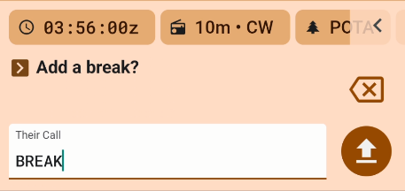

Typically, PoLo operations are devoted to one location e.g. a park or summit activation. If multiple parks are activated simultaneously, PoLo will generate multiple logs, one for each reference, and one full log of the operation containing lookup/personal data depending on your preference settings.

#### The BREAK Command
With the use of the BREAK command it is possible to remain logging in one Operation yet insert a BREAK from your current location and start in another location. This command applies also to hunters who wish to record their new/next current location for the next batch of QSOs.

See also [Operation Notes](../operation-notes/) for other "Their Call" field entry commands.

#### Creating the BREAK

Enter BREAK in the "Their Call" field. If you are in a General Operation, the break will show your current gridsquare as a line break in your QSO list

Now change your grid square in the Operation | Location and when you return, the break line will show the new gridsquare.

If you are in an activation operation, change your park or other activation reference(s) and when you return, the break will show the new park or reference ID and gridsquare.

#### Log exports

Continue on adding contacts until you make another break or go QRT.

When you have finished the operation, the Export list of logs for the Operation will show a log for each break and an overall "full" log for all QSO across the operation.

The QSOs in the full log will have the grid location and MY_SIG_INFO fields relevant to each break.

As usual, the individual logs for each reference can be used to upload to your program admin and the full log can be imported to your log manager in one step.

Combining contests and park activation is an ideal condidate for this type of operation setup. Your exchanges can change but you will finish up with one log which makes it easier to submit to your contest.

See also [Consuming PoLo Notes](../operation-notes/#consuming-the-polo-notes)