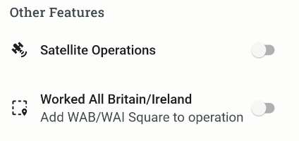
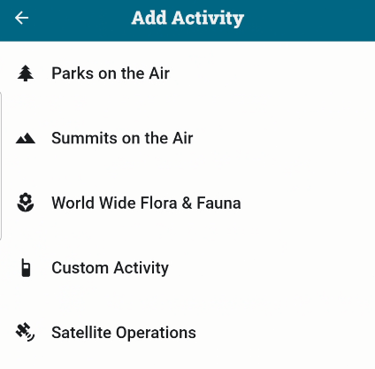
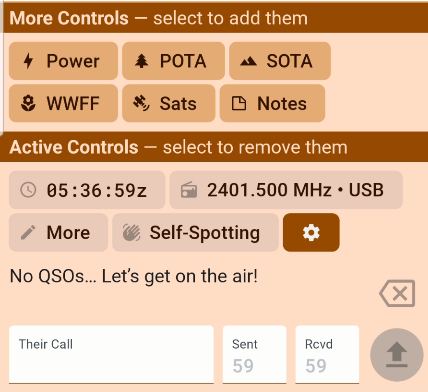
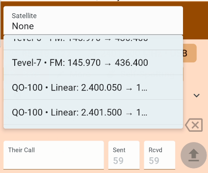
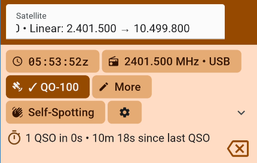

### Enabling a Satellite Operation

Scroll down on the App Features tab to find "Other Features". Enable Satellite Operations.

Next, create a New Operation and in the Activities section, add Satellite Operations.

Next go to the QSO tab of the Operation and open the "More Controls" section. Tap the Sats control to bring the satellite list into view for the operation.

Selecting the Stats button will provide a drop-down list of the satellites currently available in PoLo, select the one you are working. It should bring the frequencies into view for that satellite.

Ensure that the satellite you are selecting is visibly selected in the control panel.

The export feature will export all fields associated with these satellite contacts.

[The list of satellites available for selection within PoLo can be found here](https://github.com/ham2k/polo.ham2k.com/blob/main/content/en/data/satellites.json).

If you are aware of a satellite missing from this list please leave a message to the effect on the <a href='https://forums.ham2k.com/' target='_blank'>PoLo support forums</a>