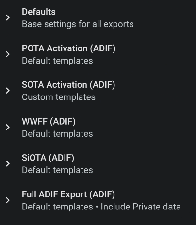
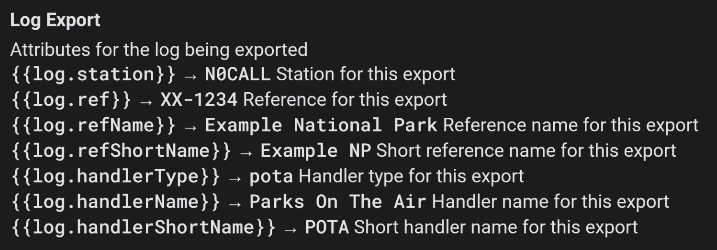
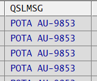
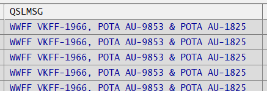
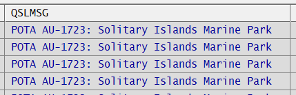
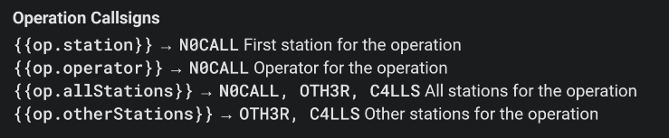
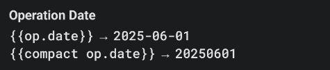
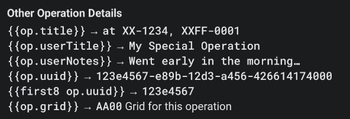
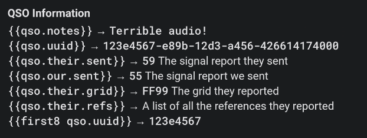

### Filenames
Each operation activity has a default filename convention which is based on tradition or specification from each activity. For example, WWFF log filenames are typically formatted as CALLSIGN@PARKID YYYYMMDD.ADI while POTA log filenames are formatted as CALLSIGN@PARKID-YYYYMMDD.adi.

But these names can be modified to suit your own filing habits if needed. In reality, POTA filenames can be anything you like as long it contains legal filenaming characters. The log uploader will attempt to recognise the park name and location from the PARKID in the filename, if it's missing you will be prompted to supply it before processing can be done.

To this end, PoLo offers a way to customise the export log filename to something you prefer in lieu of the default.

Under General Settings, you will find Export Settings.

### Export Field Values
Most field values are set during a QSO and are required for QSL purposes, e.g. callsign, mode date/time etc.
But some may be used for personal comments or notes and may also be used in personalising QSL information e.g. the ADIF QSLMSG field.



At this time, it is possible to customise the ADIF **QSO Notes**, **QSO Comments** and **QSL Message** field values. The default customised QSL Message value is:

```{{#join op.refs separator=", " final=" & "}}{{or shortLabel label key}}{{/join}}```

This is read as: *concatenate (join) the operation references separated by commas then add an ampersand before the last reference using the shortLabel* and will produce a QSL Message for each POTA log like this:



of for the full log like this



Using this instead
```{{#join op.refs separator=", " final=" & "}}{{or longLabel label key}}{{/join}}```
will produce a QSL Message with the long reference name like this



Some further field values for use in the export log fields are:








