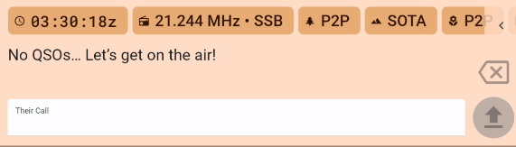
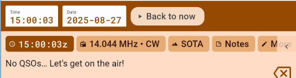
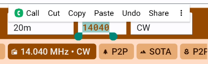
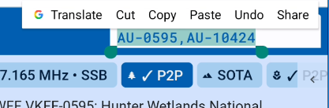

### Shortcut Commands entered in the Callsign Input Field (labelled "Their Call")

When you are in the callsign input field, you can use the following shortcuts, always followed by the `[Send]` key or button on the screen:

* Enter a band or mode to change the current band or mode. For example `20m` or `CW`.

* Enter a frequency to change the current frequency (and band). For example `14.070` or `14070`.

* Enter a power level to change the current power level. For example `5W` or `100W`.

* Enter a new decimal frequency to change just part of the current frequency. For example, if you are on `14.245` and you type `.247`, the frequency will change to `14.247`.

* Enter a time or date to change the QSO time. For example `14:30` or `14:30:25` for time, or `05-09` for May 9th.

* Enter a time difference to change the QSO time. For example, if you are logging a QSO at `14:30` and you type `+15m`, the time will change to `14:45`. If you type `-1h`, the time will change to `13:30`. You can use `h` for hours, `m` for minutes, and `s` for seconds, as well as `d` for days and `w` for weeks. **See also "Back to Now" in Post Logging below.**

* Enter `QRV`, `QSY`, or `QRT` to self-spot with the respective comment. Enter `SPOTME` or `SPME` to self-spot with current frequency and mode but no comments.

* Change operators with `OPER/` or `OP/` followed by the new operator's callsign.

* Enter `KONAMI` to enable or disable [Developer Mode](../developer-mode/).

### Smart Data Entry
See the [Call Stacking](../callsign-stacking/) section for handling pile-ups.

In most activation reference fields (POTA, SOTA, etc) you only need to enter letters and number, and PoLo will automatically fill in any dashes and slashes. And in many cases you can skip the prefix too and PoLo will guess it from the callsign.

So for a POTA Park-to-Park contact with, say, `LB4FH` in `NO-2518`, you can just enter `2518` and PoLo will fill in the rest.

For SOTA reference `VK1/AC-001`, all you need is to enter `VK1AC001`.

### Quick field selection
Use the `[space]` key to quickly select the next field in the form. This is especially useful when you are logging a lot of contacts and want to keep your hands on the keyboard.

Also, if the report is just `59`, you can leave the field empty.

Some keyboards also support using the `[tab]` key to move to the next field, but this can be less reliable. We're working on
expanding this to more keyboards, but iOS and Android make it harder to deal with these keys than desktop operating systems.

### Multiple QSOs at once
You can use commas to enter more than one callsign at a time and PoLo will log them as separate QSOs. This is useful, for example,
when  you log a POTA Park-to-park contact with multiple operators on the other end.

This also works when editing existing QSOs if you want to duplicate the information for another operator.

### Smart Slash
Most phone and tablet keyboards make it hard to enter a slash (`/`) character, which is often needed when logging callsigns like `WV3H/VE` or `VK1AO/P`. A period (`.`) can be used instead and PoLo will convert it to a slash.

### Bearing and distance
Entering your qrz.com credentials in Settings > Accounts > QRZ will enable PoLo to provide details of contacts you make. If you have a qrz.com subscription it will also provide bearing and distance information to your contact.

### Post Logging
Entering logs into PoLo from paper logs may be assisted by these quick entry commands.
Using the callsign entry field:
+ Type `14:55` to change the time. This also pauses the clock until you tap on the time and tap "Back to now"
+ Type `-1m` or `+3m` to adjust the time back one or forward 3 minutes.
+ Type `-1d` or `+3d` to adjust the days back one or forward 3 days.
+ Type `7200` or `7.200` to set the frequency.
+ Type `20m` to set the band - where no exact frequency is desired.
+ Type `CW` or `SSB` to set the mode.
Consecutive entries will advance the QSO time by 1 minute per entry, you may wish to adjust back or forward when you move more than a few minutes away from your written log entries.

When you have finished logging your entries, you can return the timer back to the current time by tapping the time and then the "Back to Now" button

### Frequency and Reference editing
Editing/correcting a frequency after a callsign has been entered can be achieved by tapping into the frequency box, backspacing out the entered frequency and re-entering the correct/desired frequency. Let's not forget that a quicker way to correct a frequency, avoiding multiple taps on the backspace, can be achieved by a tap and hold on the frequency.

Once the field value is seleced, typing a new frequency will wipe the old and replace with a new value.
The same can be achieved in other fields such as the reference fields.

The tap and hold action can also be achieved by 3 quick taps to select the entire field value.