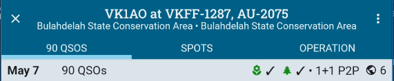

PoLo is currently also available for Android in a "Lite" version which is identical to the normal full version except for the Maps feature. A version of PoLo which excludes the maps module has proven to run on device specifications which find difficulty running the full version. PoLo Lite is a slightly cut-down version which is less demanding of device RAM and storage. Different devices have different ways to allocate and swap memory, and different graphics chips which may also contribute to the incompatibility for Maps.

The general application documentation contained here applies equally to PoLo Lite except for the absence of the Maps tab in an Operation.

PoLo Lite can be installed and run as a separate application on Android devices. The database is not shared between versions. You may consider installing Lite alongside the full version which may prove useful in future version releases if your device proves unable to run the full version.

By enabling the [Developer Mode](../developer-mode/), it is possible to export your database from one version and replace the database in the other version. The databases are compatible. In such a case, you may wish to keep both applications updated to their current version. Both applications will normally be identical in feature set under the stable releases for each. Variations in features or bug fixes may apply if you run each version in the unstable or bleeding edge release paths.

### Android
PoLo Lite is available in the Google Play Store. You can install it by clicking the badge below:

