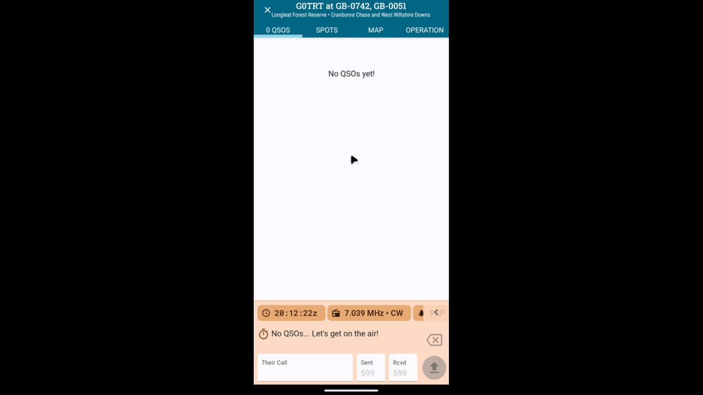

 

When an operation begins PoLo will enable you to send an activation spot. Reveal the Spotting button using the left pointing arrow in the details area; pressing the button will give you a chance to add a comment to the spot. The spot button will display icons for the activity servers in use.

Re-spotting is done in the same way, with QSY or QRT entered into the Comments window depending on the operators actions.

PoLo currently supports receiving spots from the POTA system, clicking any spot within the list on the spots tab will put all of that contact's details into a new slot on the QSO tab enabling quick and easy contact to be made.
