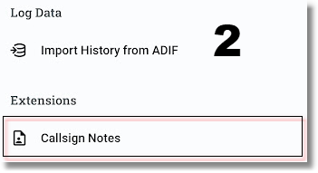
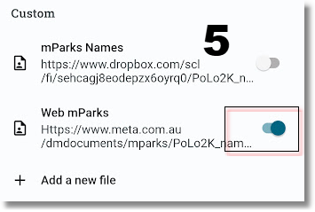
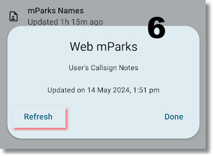

"**Callsign Notes**" is a feature that allows you to show short notes for specific callsigns in the logging screen. This can be useful to remember the name of a friend, or to know if a station is a member of a club or a special event station.

PoLo comes with a built-in file, called "**Ham2K's Hams of Note**", but you can add as many additional files as you want, and enable and disable them as needed.

The built-in Notes include emojis such as 🧑‍💻, 👷, 📺, 💻, 🌳 and others, so if you see one in the logs somewhere, this is where they come from.

### Custom Files

Custom callsign notes are stored as simple text files, one call per line followed by information you wish to show in the logging screen.

If the information starts with an emoji, it will be shown in log and spotting entries.

Empty lines, and lines that start with `#` are ignored.

### File Format

An example of the simplest format used for the file would be:

```
VK1AO Alan
VK4KC Marty
KI2D Sebastián
# etc
```

The file also supports simplified markdown tags [similar to the ones used on GitHub](https://docs.github.com/en/get-started/writing-on-github/getting-started-with-writing-and-formatting-on-github/basic-writing-and-formatting-syntax). So you may supply hyperlinks and text formatting which is then used by PoLo to display the text.

### File storage and access

Once this file is created, you may place the file in your favourite cloud storage folder and copy the public link for the file to be installed into PoLo.

The URL you provide must be a direct link to the file in plain text, and not a link to a web page that contains the file as it's often the case for file sharing tools and cloud storage services.

However, PoLo knows how to handle some cloud storage services, and can automatically convert the link to a direct link.
This is currently supported for Dropbox, OneDrive, Google Drive and Google Docs.

#### Step 1:

In the application Settings, tap Data Settings.


#### Step 2:

In the Data Settings, tap Callsign Notes



#### Step 3:

In the Callsign Notes page, click on `+ Add a new file` then give the file a name and copy the url into the Location field. Activate the file with the slider control.


#### Step 4:

In the Custom window, provide a name for your files and paste the url for the file into the Location field. The resource provided from a Cloud service must be granted _public access_ or _shared with everyone_.


#### Step 5:

Click Done to return to the Callsign Notes, then enable the file you have added by using the slider control



#### Step 6:

From this point, you may return to the Offline Data page and click on the file name so you can Refresh the file. This action will pull the file onto the device. The date and time of the last update is shown in this dialog so future refresh actions can be managed as your wish. Click Done.



Watch this video for a live demonstration.

[](https://youtu.be/t-diwmvjQtQ)

For more videos, [check out the Ham2K YouTube channel](https://www.youtube.com/@Ham2KApps/videos)