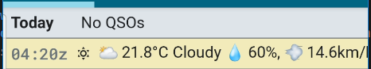

Keep a track of things.. grab the solar data, grab the current weather at your location or add a note for later.

Key words entered in the "Their Call" entry field will prompt either the collection of this data or further entry of a note.

#### NOTE


Type NOTE and you will be prompted to keep typing to add a free-form note into your operation.


#### WEATHER

Enter WEATHER to pull the current weather for your location. If you wait before pressing send, the weather information will be displayed on screen. If you then press send, it will be saved to the log.



#### SOLAR

Enter SOLAR to pull the current solar data from [hamqsl.com](https://www.hamqsl.com/solarxml.php) and display the data in a QSO line of the operation. If you wait before pressing send, the weather information will be displayed on screen. If you then press send, it will be saved to the log.


Notes entered in this form are exported as additional ADIF fields in the export file. They contain multibyte characters (HTML encoded emojis). The field names are not part of the ADIF specification and will be ignored by your usual logging program.


See also [Rove Operations](../rove-operations/) for and explanation of the BREAK command.

#### Consuming the PoLo Notes

The PoLo notes, SOLAR, WEATHER, NOTE, START, BREAK are all exported in the ADIF file as the following ADIF fields:

```
X_HAM2K_SOLAR
X_HAM2K_SOLAR_DATA
X_HAM2K_WEATHER
X_HAM2K_WEATHER_DATA
X_HAM2K_NOTE
X_HAM2K_START
X_HAM2K_BREAK
```

These fields will be ignored by most applications processing ADIF files but they may be of interest to some application developers.

While the format of SOLAR and WEATHER are as you see them on screen, the format of the SOLAR_DATA and WEATHER_DATA fields which are exported only, is json and can be further parsed.
